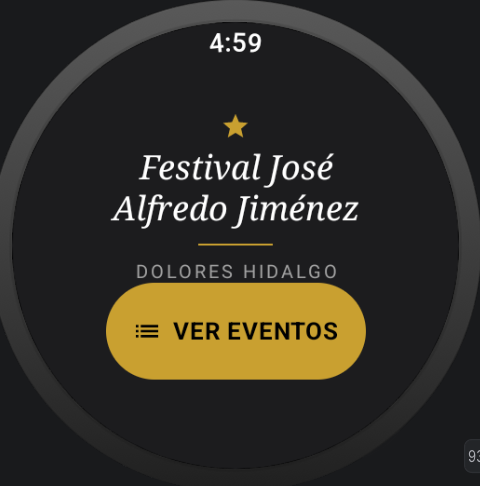
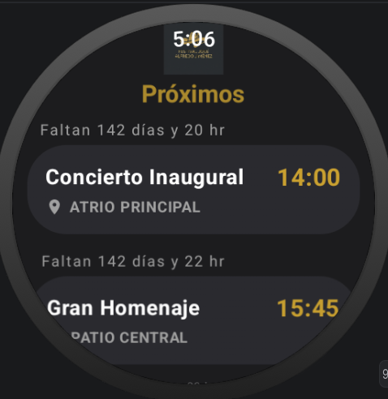
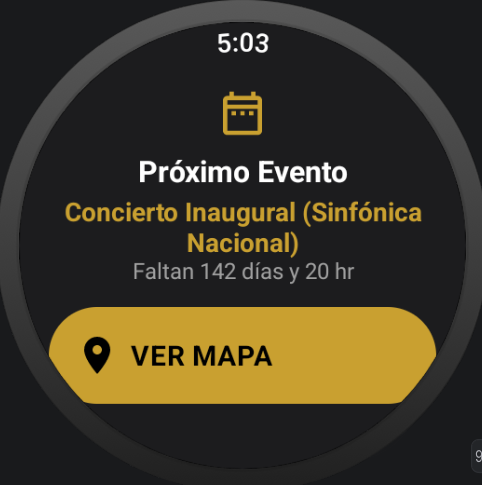
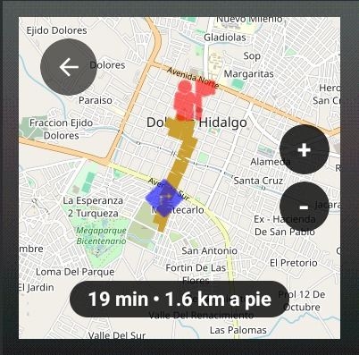
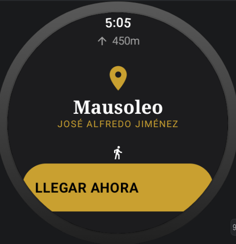

# FestivalTrack - Proyecto Final Wear OS

## 📝 Datos del Proyecto
* **Nombre del proyecto:** FestivalTrack
* **Nombre de los estudiantes estudiante:**
Chavero Martínez Noé
Cruz Méndez Juan Gustavo Ángel
Salinas Salinas Omar
* **Grupo:** GIDS6092

## 🎯 Objetivo
Desarrollar una aplicación funcional para relojes inteligentes (Wear OS) y un backend en la nube que permita a los asistentes de un festival consultar la agenda de eventos, ver los detalles de cada presentación, y utilizar un sistema de navegación por GPS integrado para guiarlos a los diferentes escenarios en tiempo real. 

El proyecto demuestra el dominio de control de versiones, la implementación de buenas prácticas de desarrollo móvil y la integración de hardware (sensores GPS).

## ✨ Descripción de las funcionalidades
* **Sincronización en la Nube:** La aplicación obtiene la lista de eventos desde un backend alojado en Neon (PostgreSQL + NestJS) ya sea mediante red Wi-Fi directa o Bluetooth usando el DataLayer de Wear OS.
* **Filtros Dinámicos de Tiempo:** El sistema de eventos cuenta con cronómetros inteligentes en vivo que restan la hora de los servidores con la hora local, ocultando eventos pasados y mostrando el tiempo restante (días, horas, minutos) para los eventos futuros.
* **Panel de Alertas Dinámico:** Pantalla específica para notificar al usuario sobre eventos próximos a comenzar, calculando el tiempo restante en tiempo real.
* **Integración de Sensores (GPS):** Se utiliza `FusedLocationProviderClient` de los Google Play Services para obtener la ubicación exacta del usuario en el reloj inteligente.
* **Navegación y Mapa Interactivo:** Renderizado de mapas mediante OSMDroid, trazando rutas peatonales inteligentes desde la ubicación del usuario hasta el escenario del evento seleccionado. Se implementaron controles de zoom nativos para Wear OS y soporte para gestos táctiles.

## 🛠️ Tecnologías utilizadas
* **Frontend (Wear OS):** Kotlin, Jetpack Compose for Wear OS, MVVM Architecture, Room Database (Offline-First).
* **Backend:** Node.js, NestJS, Prisma ORM, PostgreSQL (Neon).
* **Mapas y Geolocalización:** OSMDroid, OSRM Routing API, Google Play Location Services.
* **Control de Versiones:** Git y GitHub.

## 🚀 Instrucciones para ejecutar el proyecto

### Prerrequisitos
- Android Studio Ladybug (o superior).
- Un emulador Wear OS (API 33+) o un reloj inteligente físico conectado por ADB.
- Conexión a internet para sincronizar los eventos y cargar el mapa.

### Pasos
1. Clonar el repositorio desde GitHub.
2. Abrir el proyecto en **Android Studio**.
3. Esperar a que Gradle termine de sincronizar las dependencias.
4. En la barra superior, seleccionar el módulo **`wear`**.
5. Dar clic en el botón de **Run (Play)** y seleccionar el emulador o dispositivo físico.
6. Otorgar los permisos de ubicación cuando la app lo solicite.
7. La aplicación cargará automáticamente los eventos disponibles y permitirá la navegación GPS al dar clic en el botón de "Ver Mapa".

## 📸 Capturas de pantalla de la aplicación
*(Las capturas se encuentran detalladas en la carpeta `evidencias` del repositorio)*
* **Pantalla Principal:**
  
* **Próximos Eventos:**
  
* **Pantalla de Alerta / Temporizador:**
  
* **Navegación GPS y Mapa:**
  
* **Ubicación GPS Exacta:**
  

